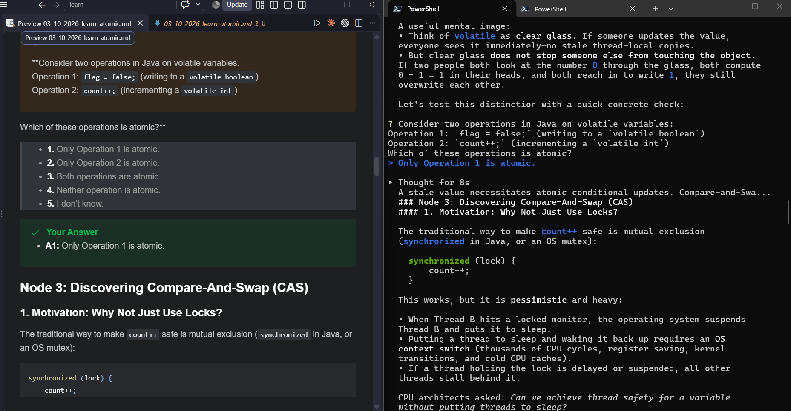

# Learn with AI (Google Antigravity Edition)

> Forked from [amosblomqvist/learn](https://github.com/amosblomqvist/learn) and adapted from [Pi](https://github.com/earendil-works/pi) to **Google Antigravity CLI (`agy`)**.

An interactive, first-principles AI tutoring environment designed to run in your terminal while continuously rendering rich lessons, LaTeX mathematics, interactive checkpoints, and vector diagrams in real time inside **Obsidian** or **VS Code**.

---

## How It Works (Dual-Pane Learning Workflow)

Terminals excel at fast, keyboard-driven interaction, but struggle with rich typography, LaTeX equations, and visual diagrams. This project gives you a **dual-pane workflow**:

1. **Terminal (`agy`)**: For dialogue, answering quizzes, and selecting options.
2. **Obsidian / VS Code**: Kept open side-by-side to read the live, auto-updating lesson notes.



- **Separated Lesson Notes (`lesson/`)**: Each session automatically creates its own note following the pattern `lesson/dd-mm-yyyy-name-of-this-file.md` (e.g. `lesson/03-10-2026-learn-Java.md`). Active chats update their corresponding file in real time without conflicting across topics.
- **Instant Questions & Answers**: When the AI asks a question, it appears in your note immediately (via `PreToolUse`), and when you answer, your choice is instantly recorded (via `PostToolUse`).
- **LaTeX Math Support**: Formulas like `$f(x)$` and `$$\int e^x dx$$` render natively.
- **Clean Vector Visuals**: Diagrams generated by maker subagents are rendered as SVG/PNG in `viz/` and embedded inline.

---

## System Architecture

All configurations reside in the `.agents/` workspace directory:

- **`.agents/skills/teach/`** — Core Socratic teaching doctrine (_Unconditional truths first_ and _"How could I have discovered this?"_), adapted to use Antigravity's native `ask_question` tool.
- **`.agents/skills/visualize/`** — Creative-director guidelines for briefing maker subagents, rendering diagrams, and visually verifying outputs before embedding.
- **`.agents/rules/`** — Dedicated subagent definitions:
  - `researcher.md` — Web research specialist to verify definitions and avoid hallucinations.
  - `mermaid-maker.md` — Structural/relational diagram author (renders and verifies with `view_file`).
  - `svg-maker.md` — Geometric and spatial diagram author.
- **`.agents/scripts/`**:
  - `md_log_sync.js` — Live mirroring engine that processes session events and streams clean Markdown into `lesson/`.
  - `render_mermaid.js` — Cross-platform renderer for Mermaid diagrams to vector SVG/PNG.
  - `render_svg.js` — Cross-platform renderer for SVG visuals.
- **`.agents/hooks.json`** — Hooks into Antigravity lifecycle (`PreToolUse` for questions, `PostToolUse` for answers, `PostInvocation` for lessons and diagrams).

---

## Requirements

- **[Google Antigravity CLI (`agy`)](https://antigravity.google)**
- **Node.js** (v18+)
- (Optional) `@mermaid-js/mermaid-cli` for local Mermaid diagram rendering (the script automatically falls back to `npx`).
- (Optional) `rsvg-convert` or ImageMagick (`magick`) for SVG preview rendering.

---

## Setup & Quickstart

1. **Clone or Open this repository** in your terminal:

   ```bash
   cd D:\Learn_With_AI\learn
   ```

2. **Open Obsidian or VS Code**:
   Open this project directory as an Obsidian vault or in VS Code with Markdown preview enabled.

3. **Start Antigravity CLI**:

   ```bash
   agy
   ```

4. **Ask the AI to teach you a topic**:

   ```
   /teach i want to learn Java
   ```

   or

   ```
   /teach i want to learn system design
   ```

5. **Read along in real time**:
   Open the generated file in `lesson/` (e.g. `lesson/03-10-2026-learn-Java.md`) in your editor to watch the lesson, equations, quizzes, and diagrams build live!
